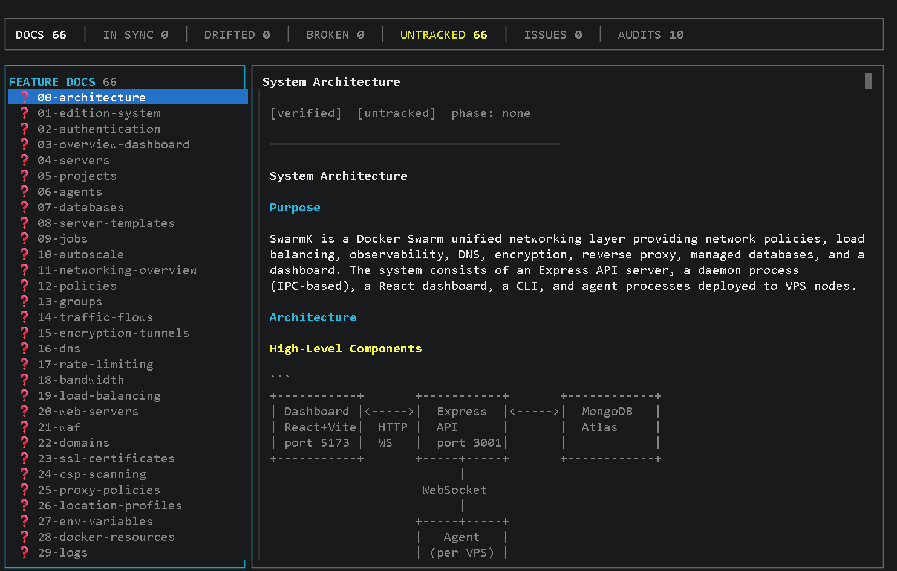

# Claude Code Starter Kit

[](https://github.com/TheDecipherist/claude-code-mastery-project-starter-kit/actions/workflows/ci.yml)

> ## [View the Full Interactive Guide →](https://thedecipherist.github.io/claude-code-mastery-project-starter-kit/)
>
> The GitHub Pages site has the complete documentation with syntax highlighting, navigation, and visual examples.

> The definitive starting point for Claude Code projects.
> Based on [Claude Code Mastery Guides V1-V5](https://github.com/TheDecipherist/claude-code-mastery) by TheDecipherist.

---

## What Is This?

This is a **scaffold template**, not a runnable application. It provides the infrastructure (commands, hooks, skills, agents, documentation templates) that makes Claude Code dramatically more effective. You use it to **create** projects, not run it directly.

### Three Ways to Use It

**A. Scaffold a new project (most common):**
```bash
/new-project my-app clean    # or: /new-project my-app default
cd ~/projects/my-app
/setup
```
This creates a new project directory with all the Claude Code tooling pre-configured. Run `/quickstart` for a guided walkthrough.

**B. Convert an existing project:**
```bash
/convert-project-to-starter-kit ~/projects/my-existing-app
```
Non-destructive merge — brings all starter kit infrastructure (commands, hooks, skills, agents, CLAUDE.md rules) into your existing project while preserving everything you already have. Creates a safety commit first so you can `git revert HEAD` to undo.

**C. Customize the template itself:**
Clone this repo and modify the commands, hooks, skills, and rules to match your team's standards. Then use your customized version as the source for `/new-project`.

> **What NOT to do:** Don't clone this repo and run `pnpm dev` expecting a working app. This is the *template* that creates apps — it's not an app itself. If you're looking to build something, start with option A above.

## Learning Path

Progress through these phases at your own pace. Each builds on the previous one.

The starter kit supports two development workflows:
- **Classic** — `/review`, `/commit`, `/create-api`, `/create-e2e` (individual commands, you drive)
- **MDD** — `/mdd` (structured Analyze → Document → Test → Code workflow, Claude drives with your approval)

Both use the same hooks, rules, and quality gates. MDD adds structured documentation and audit capabilities on top.

```
Phase 1                Phase 2              Phase 3              Phase 4              Phase 5
INITIAL SETUP          BUILD FEATURES       QUALITY & TESTING    DEPLOYMENT           ADVANCED
(5 minutes)

/install-global   -->  /mdd <feature>  -->  /mdd audit      -->  /optimize-docker -->  /refactor
/new-project           /review              /mdd status          /security-check       /what-is-my-ai-doing
cd my-app              /commit              /create-e2e          deploy                /worktree
/setup                 /create-api          /test-plan                                 custom rules
```

### First 5 Minutes

```bash
/install-global                    # One-time: install global Claude config
/new-project my-app clean          # Scaffold a project (or: default for full stack)
cd ~/projects/my-app               # Enter your new project
/setup                             # Configure .env interactively
pnpm install && pnpm dev           # Start building
```

### First Feature (MDD Workflow)

```bash
/mdd add user authentication       # Claude interviews you, writes docs, generates
                                    # test skeletons, presents a plan, then builds
```

Use `/help` to see all 27 commands at any time.

## See It In Action

| | |
|---|---|
|  |  |
| **`/help`** &mdash; All 26 commands | **`/review`** &mdash; Catching violations with severity ratings |
|  |  |
| **Auto-Branching** &mdash; Hook blocks commits to main | **Lint-on-Save** &mdash; TypeScript errors caught instantly |
|  |  |
| **`/diagram architecture`** &mdash; Generated from actual code | **`/setup`** &mdash; Interactive .env configuration |
|  |  |
| **AI Monitor** &mdash; Free mode, no API key needed | **E2E Tests** &mdash; Good vs bad assertions |

## What's Included

Everything you need to start a Claude Code project the right way — security, automation, documentation, and testing all pre-configured.

- **CLAUDE.md** — Battle-tested project instructions with 11 numbered critical rules for security, TypeScript, database access, testing, and deployment
- **Global CLAUDE.md** — Security gatekeeper for all projects. Never publish secrets, never commit .env files, standardized scaffolding rules
- **28 Slash Commands** (17 project + 11 kit management)
  - **Project** (copied into every scaffolded project): `/mdd`, `/help`, `/review`, `/commit`, `/progress`, `/test-plan`, `/architecture`, `/security-check`, `/optimize-docker`, `/create-e2e`, `/create-api`, `/worktree`, `/what-is-my-ai-doing`, `/refactor`, `/diagram`, `/setup`, `/show-user-guide`
  - **Kit management** (starter kit only): `/new-project`, `/update-project`, `/convert-project-to-starter-kit`, `/install-global`, `/install-mdd`, `/quickstart`, `/projects-created`, `/remove-project`, `/set-project-profile-default`, `/add-project-setup`, `/add-feature`
- **9 Hooks** — Deterministic enforcement that always runs. Block secrets, lint on save, verify no credentials, branch protection, port conflicts, Rybbit pre-deploy gate, E2E test gate, env sync warnings, and RuleCatch monitoring (optional — skips silently if not installed)
- **Skills** — Context-aware templates: systematic code review checklist and full microservice scaffolding
- **Custom Agents** — Read-only code reviewer for security audits. Test writer that creates tests with explicit assertions
- **Documentation Templates** — Pre-structured ARCHITECTURE.md, INFRASTRUCTURE.md, and DECISIONS.md templates
- **Testing Templates** — Master test checklist, issue tracking log, and StrictDB integration that prevents connection pool explosion
- **Live AI Monitor** — See every tool call, token, cost, and violation in real-time with `/what-is-my-ai-doing`. Free monitor mode works instantly — no API key, no account. Run `pnpm ai:monitor` in a separate terminal. Zero token overhead

## MDD Workflow — Manual-First Development ✨ NEW

> **We used MDD to audit this starter kit.** Result: 20 findings discovered, 17 fixed, and 125 tests written from zero — all in **23 minutes**. The methodology the starter kit teaches was used to audit the starter kit itself.

> **Parallel workflows supported.** `/mdd` now asks if you want to work in an isolated worktree — run multiple `/mdd` sessions simultaneously, each in its own directory and branch. Use `/worktree` for complete isolation.

MDD is the built-in development methodology that turns Claude Code from a code generator into a development partner. Every feature starts with documentation. Every fix starts with an audit.

### The Problem

Most people prompt Claude Code like this: *"fix the bug in my auth system."* Claude reads 40 files, burns through context trying to understand your architecture, and produces something that technically compiles but misses the bigger picture.

MDD flips this. You write structured documentation first, then Claude reads **one doc** instead of 40 files. It gets the full picture in 200 tokens instead of 20,000.

### The Workflow: Document → Audit → Fix → Verify

Every phase reads the output of the previous phase, compressing context further at each step:

| Phase | What Happens |
|-------|-------------|
| 📋 **Document** | Write feature docs with YAML frontmatter in `.mdd/docs/` |
| 🔍 **Audit** | Read source code, write incremental notes to disk (survives compaction) |
| 📊 **Analyze** | Read notes only → produce severity-rated findings report |
| 🔧 **Fix** | Execute pre-planned fixes with tests |
| ✅ **Verify** | Tests pass, types check, documentation updated |

### Usage — One Command, Fifteen Modes

```bash
# Build a new feature (Analyze → Document → Test skeletons → Plan → Implement → Verify)
/mdd add user authentication with JWT tokens

# Audit existing code (Scope → Read + Notes → Analyze → Present → Fix)
/mdd audit
/mdd audit database    # audit a specific section

# Check MDD status and rebuild .mdd/.startup.md (includes drift summary)
/mdd status

# Detect code that changed outside MDD — catch doc drift before it silently spreads
/mdd scan

# Create a one-off task doc (follows full MDD workflow, but frozen — never shows as drifted)
/mdd task refactor db-query script
/mdd task investigate auth flow latency

# Update an existing feature doc after code has changed
/mdd update 04            # by number
/mdd update content-builder

# Generate docs from undocumented code, or regenerate an existing doc
/mdd reverse-engineer src/handlers/payments.ts
/mdd reverse-engineer 07  # regenerate doc 07 by comparing code vs existing doc

# Show cross-feature dependency graph with broken/risky dep warnings
/mdd graph

# Retire a feature cleanly — archive doc, flag dependents, optionally clean up files
/mdd deprecate 03

# Batch-patch missing frontmatter (last_synced, status, phase) across all docs
# Fixes the UNTRACKED state — use once when upgrading from an older MDD version
/mdd upgrade

# Append a note to .mdd/.startup.md (survives compaction)
/mdd note "just switched to PostgreSQL"
/mdd note list          # view all notes
/mdd note clear         # wipe notes section

# ── Initiative / Wave Planning (NEW) ────────────────────────────────────────────

# Create a new initiative (groups related waves and features into one roadmap item)
/mdd plan-initiative "auth system"             # guided mode
/mdd plan-initiative "auth system" --template  # write raw markdown yourself

# Add a wave to an initiative (a phase of work with a concrete demo state)
/mdd plan-wave auth-system "Auth Foundation"
/mdd plan-wave auth-system "Auth Foundation" --template

# Execute a wave — turns planned features into MDD docs and starts implementation
/mdd plan-execute auth-system-wave-1

# Sync wave docs after the parent initiative changes (version bump)
/mdd plan-sync auth-system

# Remove a feature from a wave (before it has a doc)
/mdd plan-remove-feature auth-system-wave-1 auth-signup

# Cancel an initiative and all its planned work
/mdd plan-cancel-initiative auth-system

# Show a reference table of every /mdd mode and what it does
/mdd commands
```

**Build mode** (`/mdd <description>`) — 7 phases, 3 mandatory gates:

- **Pipeline:** Understand → Analyze → Document → Test Skeletons + **Red Gate** → Plan → Implement + **Green Gate** → Verify + **Integration Gate**
- **Phase 1** gathers context using 3 parallel Explore agents (rules, existing features, codebase structure)
- **Phase 2** is a mandatory **Data Flow & Impact Analysis** gate — traces every data value end-to-end before writing a line of docs; skipped automatically on greenfield projects
- Questions are context-adaptive — tooling tasks skip the database and API questions entirely
- **Red Gate** runs every test skeleton to confirm it actually fails before implementation begins
- Build plan uses **commit-worthy blocks** with runnable end-states, verification commands, and handoff contracts; independent blocks are annotated for parallel execution
- **Green Gate** implements each block with a 5-iteration diagnosis-first loop — states root cause before each fix; stops at 5 and reports to the user rather than continuing blindly
- **Integration Gate** verifies real behavior (real HTTP calls, real DB, real browser) before marking complete; blocked features get `⏸️ MDD Blocked` with a concrete next step

**Audit mode** (`/mdd audit`) — complete security and quality audit, 5 phases:

- **A1 Scope** — reads `.mdd/docs/` to build the feature map; auto-generates docs if none exist
- **A2 Read + Notes** — features batched across up to 3 parallel Explore agents; notes written to disk so findings survive context compaction
- **A3 Analyze** — reads notes file only to produce a severity-rated findings report
- **A4 Present** — shows top findings with effort estimates and asks what to fix
- **A5 Fix** — applies fixes, writes tests, updates documentation
- Auto-branches to `fix/mdd-audit-<date>` before making any changes

**Scan mode** (`/mdd scan`) — detects documentation drift (features whose source files changed since last session):

- A single Explore agent runs all `git log --after="<last_synced>"` checks in one pass
- Returns a classification table: ✅ in sync / ⚠️ drifted / ❌ broken reference / ❓ untracked
- Task docs (`type: task`) appear in a separate frozen section — never flagged as drifted
- Saves a full drift report to `.mdd/audits/scan-<date>.md`

**Update mode** (`/mdd update <feature-id>`) — re-syncs a feature doc after code changes:

- Reads current source files, diffs them against the doc, presents "what changed"
- Rewrites only the affected sections; never touches unchanged content
- Appends new test skeletons for newly documented behaviors without modifying existing tests
- Updates `last_synced` in frontmatter

**Reverse-engineer mode** (`/mdd reverse-engineer [path|feature-id]`) — generates MDD docs from existing code:

- Works on undocumented files (new doc) or existing docs (regenerate + compare)
- ≤3 files read directly in the main conversation; 4+ files batched across up to 3 parallel Explore agents
- Always shows a diff in regenerate mode so you can merge rather than blindly overwrite
- Discloses limitations — business intent and implicit constraints must be manually reviewed

**Graph mode** (`/mdd graph`) — renders an ASCII dependency map from `depends_on` fields:

- Flags broken dependencies (deprecated features still depended on)
- Flags risky dependencies (complete features depending on in-progress ones)
- Identifies orphans (no connections either way)
- When `.mdd/initiatives/` exists: appends an initiative → wave → feature hierarchy tree showing progress and broken doc links

**Deprecate mode** (`/mdd deprecate <feature-id>`) — retires a feature cleanly:

- Sets `status: deprecated` and moves the doc to `.mdd/docs/archive/`
- Adds known-issue warnings to all dependent docs
- Asks separately whether to delete source files and test files — never auto-deletes

**Upgrade mode** (`/mdd upgrade`) — batch-patches missing frontmatter fields across all docs:

- Adds `last_synced`, `status`, and `phase` to any doc missing them
- Non-destructive — existing fields are never overwritten
- `last_synced` inferred from `git log` on each doc file (not today's date) so drift stays accurate
- Shows a plan and asks for confirmation before writing anything
- Run once when upgrading from an older MDD version; fixes the UNTRACKED (❓) state

**Plan-initiative mode** (`/mdd plan-initiative <title>`) — creates a new initiative file in `.mdd/initiatives/`:

- Interviews you about goals, target audience, and open product questions (guided mode), or writes the raw template for you to fill in (--template)
- Generates a slug and a v1 hash; collision-checks against existing initiatives
- If an initiative with the same slug already exists and has active wave docs, blocks with an error — active code must be deprecated before overwriting

**Plan-wave mode** (`/mdd plan-wave <initiative-id> <wave-title>`) — adds a wave to an existing initiative:

- Asks about demo state, feature list, and dependencies between features in the same wave
- Writes a wave file in `.mdd/waves/` stamped with the initiative's current version
- Validates that the parent initiative exists and is not cancelled

**Plan-execute mode** (`/mdd plan-execute <wave-id>`) — turns a planned wave into real work:

- Reads the wave file; for each planned feature without a doc, runs `/mdd <feature-slug>` build mode
- Supports automated (run all) or interactive (confirm each feature) execution
- Updates each feature's `docPath` and `waveStatus` in the wave file as docs are created

**Plan-sync mode** (`/mdd plan-sync <initiative-id>`) — re-stamps all wave files after a version bump:

- Run after editing an initiative (overview, questions) — updates `initiativeVersion` in all child waves
- Surfaces stale waves flagged by `/mdd scan`

**Plan-remove-feature mode** (`/mdd plan-remove-feature <wave-id> <feature-slug>`) — removes a feature from a wave before it has been executed:

- Hard-stops if the feature already has a `docPath` — use `/mdd deprecate` for that instead
- Confirms with the user before removing

**Plan-cancel-initiative mode** (`/mdd plan-cancel-initiative <initiative-id>`) — cancels an initiative and all its planned work:

- Sets initiative `status: cancelled` and all child wave statuses to `cancelled`
- If any wave has executed features (docs with `docPath`), warns and asks how to handle them
- Cancelled initiatives are still visible in the TUI dashboard (shown in gray)

**MDD versioning** — every file created or updated by MDD is stamped with `mdd_version: N` in its frontmatter, where N matches the version declared in `mdd.md`. `/mdd status` shows a breakdown of which files are on which version so you can see at a glance what's out of sync. When you update MDD via `/install-mdd` or `/install-global mdd`, both commands compare `mdd_version` between the source and installed file and prompt before overwriting — no silent overwrites. Files without `mdd_version` (created before versioning was introduced) are treated as version 0 and flagged as outdated.

### The `.mdd/` Directory

All MDD artifacts live in a single dotfile directory, gitignored by default:

```
.mdd/
├── docs/                             # Feature documentation (one per feature)
│   ├── 01-<feature-name>.md          # auto-numbered, YAML frontmatter + last_synced/status/phase
│   ├── 02-<feature-name>.md
│   └── archive/                      # Deprecated feature docs (set by /mdd deprecate)
├── initiatives/                      # Initiative files (created by /mdd plan-initiative)
│   └── <initiative-slug>.md          # YAML frontmatter: id, title, status, version, hash
├── waves/                            # Wave files (created by /mdd plan-wave)
│   └── <initiative-slug>-wave-N.md   # YAML frontmatter + feature table; links back to docs
├── audits/                           # Audit artifacts (all gitignored)
│   ├── flow-<feature>-<date>.md      # Data flow analysis written during Phase 2
│   ├── notes-<date>.md               # Raw reading notes (Phase A2, written every 2 features)
│   ├── report-<date>.md              # Severity-rated findings report (Phase A3)
│   ├── results-<date>.md             # Before/after fix summary (Phase A5)
│   ├── scan-<date>.md                # Drift report from /mdd scan
│   └── graph-<date>.md               # Dependency graph from /mdd graph
└── .startup.md                       # Auto-generated session context (injected at startup)
```

### Real Results: Self-Audit

| Audit Step | Time | Output |
|------------|------|--------|
| Create Docs (pre-audit) | ~25 min | 9 feature docs (795 lines) in `.mdd/docs/` |
| A2: Read + Notes | 9 min 51s | 57+ files read, 837 lines of notes |
| A3: Analyze | 2 min 39s | 298-line report, 20 findings |
| A5: Fix All | 10 min 53s | 17/20 fixed, 125 tests written |
| **Total** | **~48 min** | **20 findings, 125 tests from zero** |

| Metric | Before MDD | After MDD |
|--------|-----------|----------|
| Unit tests | 0 | 94 |
| Test files | 0 | 5 |
| Documentation files | 3 | 14 |
| Known issues documented | 0 | 84 |
| Findings found & fixed | 0 | 17/20 |
| Quality gate violations | 1 (651-line file) | 0 (split into 5 modules) |
| Config validation | None (raw JSON.parse) | Zod schema with fail-fast |
| Secret detection patterns | 4 basic | 10+ (GitHub, Slack, Stripe, PEM, JWT) |

### The Incremental Write Trick

The most important technical detail: when Claude reads files during an audit, context will compact. If your findings are only in memory, they're gone. Instead, Claude writes notes to disk every 2 features. If context compacts, it reads the tail of the notes file and picks up where it left off. Zero data loss across 6 complete audit cycles.

### Startup Context -- .mdd/.startup.md

Every time a Claude Code session starts (including after `/clear` and compaction),
the starter kit injects a compact project snapshot into Claude's context automatically.
This replaces the expensive habit of Claude reading 40 files to get oriented -- it reads
one file instead.

The snapshot is stored in `.mdd/.startup.md` and has two zones:

**Auto-generated zone** (above the `---` divider) -- rewritten by `/mdd` commands:
- Current git branch
- Stack summary (framework, database, hosting)
- Features documented in `.mdd/docs/`
- Last audit results (findings found, fixed, still open)
- Rules quick-reference

**Notes zone** (below the `---` divider) -- append-only, never overwritten:
- Your own timestamped annotations added with `/mdd note`

The file is gitignored -- it is machine state, not source code. It regenerates
automatically as you use MDD.

**Commands:**

```
/mdd status              -- regenerate .startup.md from current project state
/mdd note "your note"   -- append a timestamped note
/mdd note list          -- print only the Notes section
/mdd note clear         -- wipe the Notes section
```

**Why this works:**

The SessionStart hook runs on startup, /clear, and compaction. Its only job is:
`cat .mdd/.startup.md`

One file. ~100-200 tokens. Claude is fully oriented before your first prompt.

---

## MDD Dashboard — Terminal TUI

The `mdd` package is a companion terminal dashboard for MDD workspaces. Run it inside any project that has a `.mdd/` folder to get a real-time, interactive view of your workspace health — without leaving VS Code.



```bash
npm install -g mdd-tui
```

Then inside any project with a `.mdd/` folder:

```bash
mdd              # opens the interactive TUI
mdd dashboard    # same
mdd status       # same — all three open the dashboard
```

**What it shows:**

| Panel | Contents |
|-------|----------|
| Left | **INITIATIVES** (collapsible tree, shown when `.mdd/initiatives/` exists) · feature docs · audit reports · dep graph |
| Right | Initiative overview, wave detail, or full doc/audit content with drift info, frontmatter chips, and markdown |
| Top bar | Counts: docs · in-sync · drifted · broken · untracked · issues · audits · initiatives · active waves |

**Left panel sections (top to bottom):**
- **INITIATIVES** — collapsible tree of initiatives and their waves. `▸` collapsed, `▾` expanded. Wave rows show `●` active / `✓` complete / `○` planned with a feature progress count (e.g. `2/3`).
- **FEATURE DOCS** — all docs with drift icons: `✅` in sync · `⚠️` drifted · `❌` broken · `❓` untracked
- **AUDIT REPORTS** — audit files from `.mdd/audits/`
- **DEP GRAPH** — ASCII dependency map

**Keyboard shortcuts:**

| Key | Action |
|-----|--------|
| `↑` / `k` · `↓` / `j` | Navigate left panel / scroll right panel |
| `→` / `l` / `Enter` | Focus right panel (or expand initiative) |
| `←` / `h` / `Esc` | Focus left panel |
| `i` | Jump to first initiative |
| `Page Up` / `Page Down` | Scroll right panel one page |
| `Home` / `End` | Jump to top / bottom of right panel |
| `r` | Refresh and re-scan workspace |
| `q` / `Ctrl+C` | Quit |

The dashboard auto-detects drift by running `git log` against each doc's `last_synced` frontmatter field. Docs whose `source_files` have changed since last sync are marked ⚠️ drifted.

npm: [mdd-tui](https://www.npmjs.com/package/mdd-tui) · GitHub: [TheDecipherist/mdd](https://github.com/TheDecipherist/mdd)

> **Recommended: install MDD globally.** Run `/install-global` once and answer "yes" to the MDD prompt — `/mdd` is then available in every project on your machine with no per-project setup. Update the starter kit once and every project picks up the new version automatically on the next session. When you run `/mdd` for the first time in a fresh project, it auto-creates the `.mdd/` structure (docs, audits, ops, `.startup.md`) — no separate `/install-mdd` step needed.

---

## Ops Mode — Deployment Runbooks ✨ NEW

> **The flaw MDD had:** Deployment and infrastructure tasks had no documentation home. Running `/mdd dokploy-deploy` defaulted to Build Mode and skipped the documentation phases — because deploying services isn't a feature to build. Ops Mode fixes this.

MDD now treats deployments as first-class citizens. Every deployment target gets a structured runbook — either project-local or global. Write it once — then `runop` executes it every time, with live health checks, verified steps, and canary-gated multi-region rollout.

### Commands

| Command | What it does |
|---|---|
| `/mdd ops <description>` | Create a runbook — **first question is always: global or project?** |
| `/mdd ops list` | List all runbooks — global and project — with last-run health status |
| `/mdd runop <slug>` | Execute a runbook — checks project-local first, then global |
| `/mdd update-op <slug>` | Edit an existing runbook — same lookup order |

### Global vs Project Scope

The **first thing `/mdd ops` asks** is where the runbook should live:

| Scope | Location | Use for |
|---|---|---|
| **Project** | `.mdd/ops/<slug>.md` | This project only (e.g., deploy this specific app to Dokploy) |
| **Global** | `~/.claude/ops/<slug>.md` | Reusable across all projects (e.g., update Cloudflare DNS, renew SSL certs, Docker Hub login) |

> **Global ops cannot access project-local `.env` variables or project paths.** They use `~/.env` globals only — which is exactly right for infrastructure procedures that don't belong to any one project.

**Global is the authoritative namespace.** If a global runbook named `cloudflare-dns` exists, no project can create a local runbook with the same name. This prevents any ambiguity about which runbook `runop` will execute — you always know exactly what runs.

### Write Once, Runs Every Time

```bash
# First time — creates the runbook
/mdd ops "deploy rulecatch services to dokploy US and EU"

# Every deployment after — reads the runbook, no questions asked
/mdd runop rulecatch-dokploy
```

`runop` reads `.mdd/ops/rulecatch-dokploy.md` and executes the full deployment: pre-flight checks, step-by-step procedure with verification at each step, and post-flight confirmation. No tribal knowledge. No forgotten steps. The doc IS the deployment.

### Canary-Gated Multi-Region Deployment

Deploy to your canary region first. Gate on full health verification. Only then touch primary. If canary fails — primary is never touched, still running the last good version.

```
Pre-flight Health Check — rulecatch-dokploy
──────────────────────────────────────────────────────────
                     eu-west (canary)   us-east (primary)
api                  ✓ healthy          ✓ healthy
dashboard            ✗ failing          ✓ healthy
worker               ✓ healthy          ✓ healthy

dashboard is failing in eu-west.
  (a) Redeploy   (b) Skip   (c) Abort
```

```
── eu-west (canary) — gate check ───────────────────────
api         ✓ healthy  (rulecatch-api-eu:latest)
dashboard   ✓ healthy  (rulecatch-dashboard-eu:latest)
worker      ✓ healthy
Gate: PASSED ✓ — advancing to us-east (primary)
```

```
runop complete — rulecatch-dokploy

                     eu-west (canary)   us-east (primary)
api                  ✓ healthy          ✓ healthy
dashboard            ✓ healthy          ✓ healthy
worker               ✓ healthy          ✓ healthy

Canary gate:      PASSED ✓
Regions deployed: 2/2
Steps executed:   14/14 ✓
```

### Per-Region Docker Image Overrides

Different image names for different regions? Fully supported. Each service has a default image plus per-region overrides:

```yaml
services:
  - slug: api
    image: theDecipherist/rulecatch-api:latest        # default
    regions:
      eu-west:
        image: theDecipherist/rulecatch-api-eu:latest # different name for EU
        status: healthy
        last_checked: 2026-04-18T10:00:00Z
      us-east:
        image: theDecipherist/rulecatch-api:latest    # same as default
        status: healthy
        last_checked: 2026-04-18T10:05:00Z
```

All keys are always fully populated — no implicit inheritance that breaks when you add a second region.

### Deployment Strategy Control

```yaml
deployment_strategy:
  order: sequential          # sequential | parallel
  gate: health_check         # health_check | manual | none
  on_gate_failure: stop      # stop | skip_region | rollback
  rollback_on_failure: false # auto-run rollback steps on failure
```

`on_gate_failure: stop` — canary fails, primary untouched. Investigate, fix, re-run.
`on_gate_failure: rollback` — canary fails, auto-rollback EU, primary untouched.
`on_gate_failure: skip_region` — skip the failed region and continue to primary (useful when EU is lower priority).

### Listing All Runbooks

```bash
/mdd ops list
```

```
📦 Ops Runbooks

Global (~/.claude/ops/)
  cloudflare-dns        DNS record updates via Cloudflare API       last run: 2026-04-10
  ssl-renewal           Let's Encrypt cert renewal (Certbot)        last run: never

Project (.mdd/ops/)
  rulecatch-dokploy     10 services → eu-west (canary) + us-east    last run: 2026-04-18  ✓ all healthy
  swarmk-dokploy        7 services → eu-west (canary) + us-east     last run: 2026-04-17  ⚠ api degraded

Run /mdd runop <slug> to execute any runbook.
```

### Where Runbooks Live

```
~/.claude/ops/           ← global runbooks (all projects)
  cloudflare-dns.md
  ssl-renewal.md

.mdd/
├── docs/                ← feature docs  (type: feature | task)
└── ops/                 ← project runbooks (this project only)
    ├── rulecatch-dokploy.md
    ├── swarmk-dokploy.md
    └── archive/
```

All existing modes are ops-aware: `/mdd status` shows ops runbook count, `/mdd scan` checks runbook drift, `/mdd graph` includes a runbook health summary, `/mdd audit` flags missing sections and credential security violations.

---

## Featured Packages

Five open-source npm packages by [TheDecipherist](https://github.com/TheDecipherist) — the same developer behind this starter kit — are integrated into the default build. All are MIT-licensed.

> **Full disclosure:** These packages are developed by the same person who maintains this starter kit. They are completely open source (MIT license), and the starter kit works fully without them. ClassMCP and Classpresso are auto-included in CSS-enabled profiles because they directly complement the AI-assisted CSS workflow this kit teaches. StrictDB-MCP is auto-included in database-enabled profiles. TerseJSON is documented but not auto-included.

### ClassMCP — Semantic CSS for AI

MCP server that provides semantic CSS class patterns to Claude, reducing token usage when generating or editing styles. Auto-added to the `mcp` field in CSS-enabled profiles.

```bash
claude mcp add classmcp -- npx -y classmcp@latest
```

npm: [classmcp](https://www.npmjs.com/package/classmcp) · [Website](https://classmcp.com?utm_source=github&utm_medium=readme&utm_campaign=classmcp&utm_content=featured-packages)

### StrictDB-MCP (MCP Server) — Database Access for AI

Gives AI agents direct database access through 14 MCP tools with full guardrails, sanitization, and error handling. Auto-included in database-enabled profiles (`mcp` field in `claude-mastery-project.conf`).

```bash
claude mcp add strictdb -- npx -y strictdb-mcp@latest
```

npm: [strictdb-mcp](https://www.npmjs.com/package/strictdb-mcp)

### Classpresso — Post-Build CSS Optimization

Consolidates CSS classes after build for 50% faster style recalculation with zero runtime overhead. Auto-added as a devDependency in CSS-enabled profiles. Runs automatically after `pnpm build`.

```bash
pnpm add -D classpresso
```

npm: [classpresso](https://www.npmjs.com/package/classpresso) · [Website](https://classpresso.com?utm_source=github&utm_medium=readme&utm_campaign=classpresso&utm_content=featured-packages)

### TerseJSON — Memory-Efficient JSON (Optional)

Proxy-based lazy JSON expansion achieving ~70% memory reduction for large payloads. **Not auto-included** — install only if your project handles large JSON datasets.

```bash
pnpm add tersejson
```

npm: [tersejson](https://www.npmjs.com/package/tersejson) · [Website](https://tersejson.com?utm_source=github&utm_medium=readme&utm_campaign=tersejson&utm_content=featured-packages)

## Supported Technologies

This starter kit works with any language, framework, or database. Use `/new-project my-app clean` for zero opinions, or pick a profile that matches your stack.

### Languages & Frameworks

| Category | Technologies | Notes |
|----------|-------------|-------|
| **Languages** | Node.js/TypeScript, Go, Python | Full scaffolding support for all three |
| **Frontend** | React, Vue 3, Svelte, SvelteKit, Angular, Next.js, Nuxt, Astro | CLI scaffold + CLAUDE.md rules per framework |
| **Backend (Node.js)** | Fastify, Express, Hono | API scaffolding with `/create-api` |
| **Backend (Go)** | Gin, Chi, Echo, Fiber, stdlib | Standard layout with cmd/internal/ |
| **Backend (Python)** | FastAPI, Django, Flask | Async support, Pydantic, pytest |
| **Database** | MongoDB, PostgreSQL, MySQL, MSSQL, SQLite, Elasticsearch | StrictDB for all backends |
| **Hosting** | Dokploy, Vercel, Static (GitHub Pages, Netlify) | Deployment scripts + Docker |
| **Testing** | Vitest, Playwright, pytest, Go test | Framework-appropriate test setup |
| **CSS** | Tailwind CSS + ClassMCP + Classpresso | ClassMCP (MCP) + Classpresso (post-build) auto-included in CSS profiles |

### Recommended Stacks by Use Case

| Use Case | Stack | Profile |
|----------|-------|---------|
| SPA Dashboard | Vite + React + Fastify + MongoDB | `default` |
| REST API (Node.js) | Fastify + PostgreSQL | `api` with `postgres` |
| Go Microservice | Gin + PostgreSQL | `go` with `postgres` |
| Python API | FastAPI + PostgreSQL | `python-api` |
| Vue SPA | Vue 3 + Vite + Tailwind | `vue` |
| Nuxt Full-Stack | Nuxt + MongoDB + Docker | `nuxt` |
| Svelte SPA | Svelte + Vite + Tailwind | `svelte` |
| SvelteKit Full-Stack | SvelteKit + MongoDB + Docker | `sveltekit` |
| Angular App | Angular + Tailwind | `angular` |
| Django Web App | Django + PostgreSQL + Docker | `django` |
| Content Site | Astro or SvelteKit | `static-site` or `sveltekit` |
| AI goodies only | Any — you choose everything | `clean` |

---

## Quick Start

### 1. Clone and Customize

```bash
# Clone the starter kit
git clone https://github.com/TheDecipherist/claude-code-mastery-project-starter-kit my-project
cd my-project

# Remove git history and start fresh
rm -rf .git
git init

# Copy your .env
cp .env.example .env
```

### 2. Set Up Global Config (One Time)

```bash
# Run the install command — smart merges into existing config
/install-global
```

This installs global CLAUDE.md rules, settings.json hooks, and enforcement scripts (`block-secrets.py`, `verify-no-secrets.sh`, `check-rulecatch.sh`) into `~/.claude/`. If you already have a global config, it merges without overwriting.

<details>
<summary>Manual setup (if you prefer)</summary>

```bash
cp global-claude-md/CLAUDE.md ~/.claude/CLAUDE.md
cp global-claude-md/settings.json ~/.claude/settings.json
mkdir -p ~/.claude/hooks
cp .claude/hooks/block-secrets.py ~/.claude/hooks/
cp .claude/hooks/verify-no-secrets.sh ~/.claude/hooks/
cp .claude/hooks/check-rulecatch.sh ~/.claude/hooks/
```

</details>

### 3. Customize for Your Project

1. Run `/setup` — Interactive .env configuration (database, GitHub, Docker, analytics)
2. Edit `CLAUDE.md` — Update port assignments, add your specific rules
3. Run `/diagram all` — Auto-generate architecture, API, database, and infrastructure diagrams
4. Edit `CLAUDE.local.md` — Add your personal preferences

StrictDB works out of the box — just set `STRICTDB_URI` in your `.env` and it connects to your database automatically. Built-in sanitization and guardrails run on all inputs: standard query operators pass through safely while dangerous operators are stripped. See the [Database — StrictDB](#database--strictdb) section for details.

### 4. Start Building

```bash
claude
```

That's it. Claude Code now has battle-tested rules, deterministic hooks, slash commands, and documentation templates all ready to go.

---

## Troubleshooting

### Hooks Not Firing

- Verify `.claude/settings.json` is valid JSON: `python3 -m json.tool .claude/settings.json`
- Check that hook file paths are correct and executable: `ls -la .claude/hooks/`
- Restart your Claude Code session — hooks are loaded at session start

### `pnpm dev` Fails or Does Nothing

This is a scaffold template, not a runnable app. Use `/new-project my-app` to create a project first, then run `pnpm dev` inside that project.

### Database Connection Errors

- Run `/setup` to configure your `.env` with a valid connection string
- Check that `STRICTDB_URI` is set in `.env`
- Verify your IP is whitelisted in your database provider's network access settings

### `/install-global` Reports Conflicts

This is normal. The command uses smart merge — it keeps your existing sections and only adds what's missing. If sections overlap, it preserves yours. Check the report output for details on what was added vs skipped.

### Port Already in Use

```bash
# Find what's using the port
lsof -i :3000

# Kill it
kill -9 <PID>

# Or kill all test ports at once
pnpm test:kill-ports
```

### E2E Tests Timing Out

- Kill stale processes on test ports: `pnpm test:kill-ports`
- Run headed to see what's happening: `pnpm test:e2e:headed`
- Check that `playwright.config.ts` has correct `webServer` commands and ports

### RuleCatch Not Monitoring

> **Free monitor mode requires no setup.** Run `pnpm ai:monitor` in a separate terminal — it works instantly with no API key.

- **Free monitor:** `pnpm ai:monitor` (or `npx @rulecatch/ai-pooler monitor --no-api-key`) — live view of tool calls, tokens, cost
- **Full experience:** Sign up at [rulecatch.ai](https://rulecatch.ai) for dashboards, violation tracking, and alerts, then run `npx @rulecatch/ai-pooler init --api-key=YOUR_KEY --region=us`

---

## Project Structure

```
project/
├── CLAUDE.md                    # Project instructions (customize this!)
├── CLAUDE.local.md              # Personal overrides (gitignored)
├── .claude/
│   ├── settings.json            # Hooks configuration
│   ├── commands/
│   │   ├── mdd.md               # /mdd — MDD workflow (build, audit, status)
│   │   ├── help.md              # /help — list all commands, skills, and agents
│   │   ├── quickstart.md        # /quickstart — interactive first-run walkthrough
│   │   ├── review.md            # /review — code review
│   │   ├── commit.md            # /commit — smart commit
│   │   ├── progress.md          # /progress — project status
│   │   ├── test-plan.md         # /test-plan — generate test plan
│   │   ├── architecture.md      # /architecture — show system design
│   │   ├── new-project.md       # /new-project — scaffold new project
│   │   ├── security-check.md    # /security-check — scan for secrets
│   │   ├── optimize-docker.md   # /optimize-docker — Docker best practices
│   │   ├── create-e2e.md        # /create-e2e — generate E2E tests
│   │   ├── create-api.md        # /create-api — scaffold API endpoints
│   │   ├── worktree.md          # /worktree — isolated task branches
│   │   ├── what-is-my-ai-doing.md # /what-is-my-ai-doing — live AI monitor
│   │   ├── setup.md             # /setup — interactive .env configuration
│   │   ├── refactor.md          # /refactor — audit + refactor against all rules
│   │   ├── install-global.md    # /install-global — merge global config into ~/.claude/
│   │   ├── install-mdd.md       # /install-mdd — install MDD workflow into any project
│   │   ├── diagram.md           # /diagram — generate diagrams from actual code
│   │   ├── set-project-profile-default.md # /set-project-profile-default — set default profile
│   │   ├── add-project-setup.md  # /add-project-setup — create a named profile
│   │   ├── projects-created.md   # /projects-created — list all created projects
│   │   ├── remove-project.md     # /remove-project — remove a project from registry
│   │   ├── convert-project-to-starter-kit.md # /convert-project-to-starter-kit — merge into existing project
│   │   ├── update-project.md      # /update-project — update a project with latest starter kit
│   │   ├── add-feature.md         # /add-feature — add capabilities post-scaffolding
│   │   └── show-user-guide.md    # /show-user-guide — open the User Guide in browser
│   ├── skills/
│   │   ├── code-review/SKILL.md # Triggered code review checklist
│   │   └── create-service/SKILL.md # Service scaffolding template
│   ├── agents/
│   │   ├── code-reviewer.md     # Read-only review subagent
│   │   └── test-writer.md       # Test writing subagent
│   └── hooks/
│       ├── block-secrets.py     # PreToolUse: block sensitive files
│       ├── check-rybbit.sh      # PreToolUse: block deploy without Rybbit
│       ├── check-branch.sh      # PreToolUse: block commits on main
│       ├── check-ports.sh       # PreToolUse: block if port in use
│       ├── check-e2e.sh         # PreToolUse: block push without E2E tests
│       ├── lint-on-save.sh      # PostToolUse: lint after writes
│       ├── verify-no-secrets.sh # Stop: check for secrets
│       ├── check-rulecatch.sh   # Stop: report RuleCatch violations
│       └── check-env-sync.sh    # Stop: warn on .env/.env.example drift
├── .mdd/                            # MDD workflow directory (gitignored)
│   ├── docs/                        # Feature documentation
│   └── audits/                      # Audit notes, reports, results
├── project-docs/
│   ├── ARCHITECTURE.md          # System overview (authoritative)
│   ├── INFRASTRUCTURE.md        # Deployment details
│   └── DECISIONS.md             # Architectural decision records
├── docs/                        # GitHub Pages site
│   └── user-guide.html          # Interactive User Guide (HTML)
├── src/
│   ├── handlers/                # Business logic
│   ├── adapters/                # External service adapters
│   └── types/                   # Shared TypeScript types
├── scripts/
│   ├── db-query.ts              # Test Query Master — dev/test query index
│   ├── queries/                 # Individual dev/test query files
│   ├── build-content.ts         # Markdown → HTML article builder
│   └── content.config.json      # Article registry (SEO metadata)
├── content/                     # Markdown source files for articles
├── tests/
│   ├── CHECKLIST.md             # Master test tracker
│   ├── ISSUES_FOUND.md          # User-guided testing log
│   ├── e2e/                     # Playwright E2E tests
│   ├── unit/                    # Vitest unit tests
│   └── integration/             # Integration tests
├── global-claude-md/            # Copy to ~/.claude/ (one-time setup)
│   ├── CLAUDE.md                # Global security gatekeeper
│   └── settings.json            # Global hooks config
├── USER_GUIDE.md                # Comprehensive User Guide (Markdown)
├── .env.example
├── .gitignore
├── .dockerignore
├── package.json                 # All npm scripts (dev, test, db:query, etc.)
├── claude-mastery-project.conf  # /new-project profiles + global root_dir
├── playwright.config.ts         # E2E test config (test ports, webServer)
├── vitest.config.ts             # Unit/integration test config
├── tsconfig.json
└── README.md
```

---

## Key Concepts

### Defense in Depth (V3)

Three layers of protection working together:
1. **CLAUDE.md rules** — Behavioral suggestions (weakest)
2. **Hooks** — Guaranteed to run, stronger than rules, but not bulletproof
3. **Git safety** — .gitignore as last line of defense (strongest)

### One Task, One Chat (V1-V3)

Research shows **39% performance degradation** when mixing topics, and a 2% misalignment early can cause **40% failure** by end of conversation. Use `/clear` between unrelated tasks.

### Quality Gates (V1/V2)

No file > 300 lines. No function > 50 lines. All tests pass. TypeScript compiles clean. These prevent the most common code quality issues in AI-assisted development.

### MCP Tool Search (V4)

With 10+ MCP servers, tool descriptions consume 50-70% of context. Tool Search lazy-loads on demand, saving **85% of context**.

### Plan First, Code Second (V5)

For non-trivial tasks, **always start in plan mode**. Don't let Claude write code until you've agreed on the plan. Bad plan = bad code.

Every step MUST have a unique name: `Step 3 (Auth System)`. When you change a step, Claude must **replace** it — not append. Claude forgets this. If the plan contradicts itself, tell Claude: "Rewrite the full plan."

### CLAUDE.md Is Team Memory

Every time Claude makes a mistake, **add a rule** to prevent it from happening again. Tell Claude: "Update CLAUDE.md so this doesn't happen again." Mistake rates actually drop over time. The file is checked into git — the whole team benefits from every lesson.

### Never Work on Main

**Auto-branch is on by default.** Every command that modifies code automatically creates a feature branch when it detects you're on main. Zero friction — you never accidentally break main. Delete the branch if Claude screws up. Use `/worktree` for parallel sessions in separate directories. Set `auto_branch = false` in `claude-mastery-project.conf` to disable.

### Every Command Enforces the Rules

Every slash command and skill has two built-in enforcement steps: **Auto-Branch** (automatically creates a feature branch when on main — no manual step) and **RuleCatch Report** (checks for violations after completion). The rules aren't just documented — they're enforced at every touchpoint.

### TypeScript Is Non-Negotiable (V5)

Types are specs that tell Claude what functions accept and return. Without types, Claude guesses — and guesses become runtime errors.

### Windows? Use WSL Mode

Most Windows developers don't know VS Code can run its entire backend inside WSL 2. HMR becomes **5-10x faster**, Playwright tests run significantly faster, and file watching actually works. Your project must live on the WSL filesystem (`~/projects/`), NOT `/mnt/c/`. Run `/setup` to auto-detect.

---

## CLAUDE.md — The Rulebook

The `CLAUDE.md` file is where you define the rules Claude Code must follow. These aren't suggestions — they're the operating manual for every session. Here are the critical rules included in this starter kit:

### Rule 0: NEVER Publish Sensitive Data

- NEVER commit passwords, API keys, tokens, or secrets to git/npm/docker
- NEVER commit `.env` files — ALWAYS verify `.env` is in `.gitignore`
- Before ANY commit: verify no secrets are included

### Rule 1: TypeScript Always

- ALWAYS use TypeScript for new files (strict mode)
- NEVER use `any` unless absolutely necessary and documented why
- When editing JavaScript files, convert to TypeScript first
- Types are specs — they tell you what functions accept and return

### Rule 2: API Versioning

```
CORRECT: /api/v1/users
WRONG:   /api/users
```

Every API endpoint MUST use `/api/v1/` prefix. No exceptions.

### Rule 3: Database Access — StrictDB Only

- NEVER create direct database connections — ALWAYS use StrictDB
- NEVER import raw database drivers (`mongodb`, `pg`, `mysql2`) in business logic
- Built-in sanitization and guardrails: safe operators (`$gte`, `$in`, `$regex`) pass through, dangerous operators (`$where`, `$function`) are stripped
- Use `{ trusted: true }` only for non-standard operators not in the allowlist (rare)
- One connection pool. One place to change. One place to mock.

### Rule 4: Testing — Explicit Success Criteria

```typescript
// CORRECT — explicit success criteria
await expect(page).toHaveURL('/dashboard');
await expect(page.locator('h1')).toContainText('Welcome');

// WRONG — passes even if broken
await page.goto('/dashboard');
// no assertion!
```

### Rule 5: NEVER Hardcode Credentials

ALWAYS use environment variables. NEVER put API keys, passwords, or tokens directly in code. NEVER hardcode connection strings — use `STRICTDB_URI` from `.env`.

### Rule 6: ALWAYS Ask Before Deploying

NEVER auto-deploy, even if the fix seems simple. NEVER assume approval — wait for explicit confirmation.

### Rule 7: Quality Gates

- No file > 300 lines (split if larger)
- No function > 50 lines (extract helper functions)
- All tests must pass before committing
- TypeScript must compile with no errors (`tsc --noEmit`)

### Rule 8: Parallelize Independent Awaits

When multiple `await` calls are independent, ALWAYS use `Promise.all`. Before writing sequential awaits, evaluate: does the second call need the first call's result?

```typescript
// CORRECT — independent operations run in parallel
const [users, products, orders] = await Promise.all([
  getUsers(),
  getProducts(),
  getOrders(),
]);

// WRONG — sequential when they don't depend on each other
const users = await getUsers();
const products = await getProducts();  // waits unnecessarily
const orders = await getOrders();      // waits unnecessarily
```

### Rule 9: Git Workflow — Auto-Branch on Main

- **Auto-branch is ON by default** — commands auto-create feature branches when on main
- Branch names match the command: `refactor/<file>`, `test/<feature>`, `feat/<scope>`
- Use `/worktree` for parallel sessions in separate directories
- Review the full diff (`git diff main...HEAD`) before merging
- If Claude screws up on a branch — delete it. Main was never touched.
- Disable with `auto_branch = false` in `claude-mastery-project.conf`

### Rule 10: Docker Push Gate — Local Test First

**Disabled by default.** When enabled, NO `docker push` is allowed until the image passes local verification:

1. Build the image
2. Run the container locally
3. Verify it doesn't crash (still running after 5s)
4. Health endpoint returns 200
5. No fatal errors in logs
6. Clean up, **then** push

Enable with `docker_test_before_push = true` in `claude-mastery-project.conf`. Applies to all commands that push Docker images.

### When Something Seems Wrong

The CLAUDE.md also includes a "Check Before Assuming" pattern:

- **Missing UI element?** → Check feature gates BEFORE assuming bug
- **Empty data?** → Check if services are running BEFORE assuming broken
- **404 error?** → Check service separation BEFORE adding endpoint
- **Auth failing?** → Check which auth system BEFORE debugging
- **Test failing?** → Read the error message fully BEFORE changing code

### Fixed Service Ports

| Service | Dev Port | Test Port |
|---------|----------|-----------|
| Website | 3000 | 4000 |
| API | 3001 | 4010 |
| Dashboard | 3002 | 4020 |

---

## Hooks — Stronger Than Rules

CLAUDE.md rules are suggestions. Hooks are **stronger** — they're guaranteed to **run** as shell/python scripts at specific lifecycle points. But hooks are not bulletproof: Claude may still work around their output. They're a significant upgrade over CLAUDE.md rules alone, but not an absolute guarantee.

### PreToolUse: `block-secrets.py`

Runs **before** Claude reads or edits any file. Blocks access to sensitive files like `.env`, `credentials.json`, SSH keys, and `.npmrc`.

```python
# Files that should NEVER be read or edited by Claude
SENSITIVE_FILENAMES = {
    '.env', '.env.local', '.env.production',
    'secrets.json', 'id_rsa', 'id_ed25519',
    '.npmrc', 'credentials.json',
    'service-account.json',
}

# Exit code 2 = block operation and tell Claude why
if path.name in SENSITIVE_FILENAMES:
    print(f"BLOCKED: Access to '{file_path}' denied.", file=sys.stderr)
    sys.exit(2)
```

### PreToolUse: `check-rybbit.sh`

Runs **before** any deployment command (`docker push`, `vercel deploy`, `dokploy`). If the project has `analytics = rybbit` in `claude-mastery-project.conf`, verifies that `NEXT_PUBLIC_RYBBIT_SITE_ID` is set in `.env` with a real value. Blocks with a link to https://app.rybbit.io if missing. Skips projects that don't use Rybbit.

### PreToolUse: `check-branch.sh`

Runs **before** any `git commit`. If auto-branch is enabled (default: true) and you're on main/master, blocks the commit and tells Claude to create a feature branch first. Respects the `auto_branch` setting in `claude-mastery-project.conf`.

### PreToolUse: `check-ports.sh`

Runs **before** dev server commands. Detects the target port from `-p`, `--port`, `PORT=`, or known script names (`dev:website`→3000, `dev:api`→3001, etc.). If the port is already in use, blocks and shows the PID + kill command.

### PreToolUse: `check-e2e.sh`

Runs **before** `git push` to main/master. Checks for real `.spec.ts` or `.test.ts` files in `tests/e2e/` (excluding the example template). Blocks push if no E2E tests exist.

### PostToolUse: `lint-on-save.sh`

Runs **after** Claude writes or edits a file. Automatically checks TypeScript compilation, ESLint, or Python linting depending on file extension.

```bash
case "$EXTENSION" in
    ts|tsx)
        npx tsc --noEmit --pretty "$FILE_PATH" 2>&1 | head -20
        ;;
    js|jsx)
        npx eslint "$FILE_PATH" 2>&1 | head -20
        ;;
    py)
        ruff check "$FILE_PATH" 2>&1 | head -20
        ;;
esac
```

### Stop: `verify-no-secrets.sh`

Runs when Claude **finishes a turn**. Scans all staged git files for accidentally committed secrets using regex patterns for API keys, AWS credentials, and credential URLs.

```bash
# Check staged file contents for common secret patterns
if grep -qEi '(api[_-]?key|secret[_-]?key|password|token)\s*[:=]\s*["\x27][A-Za-z0-9+/=_-]{16,}' "$file"; then
    VIOLATIONS="${VIOLATIONS}\n  - POSSIBLE SECRET in $file"
fi
# Check for AWS keys
if grep -qE 'AKIA[0-9A-Z]{16}' "$file"; then
    VIOLATIONS="${VIOLATIONS}\n  - AWS ACCESS KEY in $file"
fi
```

### Stop: `check-rulecatch.sh`

Runs when Claude **finishes a turn**. Checks RuleCatch for any rule violations detected during the session. Skips silently if RuleCatch isn't installed — zero overhead for users who haven't set it up yet.

### Stop: `check-env-sync.sh`

Runs when Claude **finishes a turn**. Compares key names (never values) between `.env` and `.env.example`. If `.env` has keys that `.env.example` doesn't document, prints a warning so other developers know those variables exist. Informational only — never blocks.

### Hook Configuration

Hooks are wired up in `.claude/settings.json`:

```json
{
  "hooks": {
    "PreToolUse": [
      {
        "matcher": "Read|Edit|Write",
        "hooks": [{ "type": "command", "command": "python3 .claude/hooks/block-secrets.py" }]
      },
      {
        "matcher": "Bash",
        "hooks": [
          { "type": "command", "command": "bash .claude/hooks/check-rybbit.sh" },
          { "type": "command", "command": "bash .claude/hooks/check-branch.sh" },
          { "type": "command", "command": "bash .claude/hooks/check-ports.sh" },
          { "type": "command", "command": "bash .claude/hooks/check-e2e.sh" }
        ]
      }
    ],
    "PostToolUse": [{
      "matcher": "Write",
      "hooks": [{ "type": "command", "command": "bash .claude/hooks/lint-on-save.sh" }]
    }],
    "Stop": [{
      "hooks": [
        { "type": "command", "command": "bash .claude/hooks/verify-no-secrets.sh" },
        { "type": "command", "command": "bash .claude/hooks/check-rulecatch.sh" },
        { "type": "command", "command": "bash .claude/hooks/check-env-sync.sh" }
      ]
    }]
  }
}
```

---

## Slash Commands — On-Demand Tools

Invoke these with `/command` in any Claude Code session. Each command is a markdown file in `.claude/commands/` that gives Claude specific instructions and tool permissions.

### `/mdd`

The core MDD workflow command. Ten modes in one:

- **`/mdd <feature description>`** — Build mode. Context-adaptive interview → documentation → test skeletons → named build plan → implementation → verification. Tests are generated before code. Claude presents a plan with time estimates and waits for approval.
- **`/mdd task <description>`** — Task mode. Identical to Build mode, but stamps the doc with `type: task` — frozen after completion, never appears as drifted in `/mdd scan`. Use for one-off investigations, refactors, or any work that is done-and-finished by definition.
- **`/mdd audit [section]`** — Audit mode. Reads all source files, writes incremental notes (survives compaction), produces a severity-rated findings report, and fixes everything. Works on the whole project or a specific section.
- **`/mdd status`** — Quick overview of feature docs, last audit date, test coverage, open findings, quality gate violations, and a lightweight drift summary.
- **`/mdd scan`** — Drift detection. Uses `git log` to find source files that changed since each feature doc's `last_synced` date. Flags drifted, broken, and untracked features.
- **`/mdd update <feature-id>`** — Re-sync an existing feature doc after code changes. Diffs code vs doc, rewrites affected sections, appends new test skeletons, updates `last_synced`.
- **`/mdd reverse-engineer [path|id]`** — Generate MDD docs from existing code, or regenerate + compare against an existing doc. Always shows diff in regenerate mode.
- **`/mdd graph`** — ASCII dependency map from `depends_on` fields, with broken and risky dependency warnings.
- **`/mdd deprecate <feature-id>`** — Archive a feature: move doc to `.mdd/docs/archive/`, flag dependents, optionally delete source and test files.
- **`/mdd upgrade`** — Batch-patch missing `last_synced`/`status`/`phase` frontmatter across all docs. The fix when the MDD Dashboard shows all docs as UNTRACKED (❓). Non-destructive; shows plan before writing.
- **`/mdd commands`** — Print a reference table of every MDD mode and what it does. Output is derived from the mode-detection block in `mdd.md` so it stays in sync as new modes are added.

All artifacts are stored in `.mdd/` (docs in `.mdd/docs/`, audit reports in `.mdd/audits/`). See the [MDD Workflow](#mdd-workflow--manual-first-development--new) section above for full details and real results.

### `/help`

Lists every command, skill, and agent in the starter kit, grouped by category: Getting Started, Project Scaffold, Code Quality, Development, Infrastructure, and Monitoring. Also shows skill triggers and agent descriptions. Run `/help` anytime to see what's available.

### `/quickstart`

Interactive first-run walkthrough for new users. Checks if global config is installed, asks for a project name and profile preference, then walks you through the first 5 minutes: scaffolding, setup, first dev server, first review, first commit. Designed for someone who just cloned the starter kit and doesn't know where to start.

### `/diagram`

Scans your actual code and generates ASCII diagrams automatically:

- `/diagram architecture` — services, connections, data flow (scans src/, routes, adapters)
- `/diagram api` — all API endpoints grouped by resource with handler locations
- `/diagram database` — collections, indexes, relationships (scans queries + types)
- `/diagram infrastructure` — deployment topology, regions, containers (scans .env + Docker)
- `/diagram all` — generate everything at once

Writes to `project-docs/ARCHITECTURE.md` and `project-docs/INFRASTRUCTURE.md`. Uses ASCII box-drawing — works everywhere, no external tools needed. Add `--update` to write without asking.

### `/install-global` ⭐ Recommended for MDD

One-time setup: installs the starter kit's global Claude config into `~/.claude/`. Also asks if you want to install MDD globally — **say yes**.

**Why global is the right choice for MDD:**
- `/mdd` becomes available in **every project** on your machine — no per-project setup
- Update the starter kit once → all projects automatically use the latest `/mdd` version on the next session
- First `/mdd` run in any project **auto-bootstraps** the `.mdd/` structure (docs, audits, `.startup.md`, gitignore entry) — no separate `/install-mdd` needed
- One place to maintain, one place to update

```bash
/install-global        # answer "yes" to the MDD global install prompt
/install-global mdd    # update only the global MDD commands — skips everything else
```

The `mdd` parameter is for when you've already run the full install once and just want to push an updated `/mdd` command to your global config. It overwrites `mdd.md` and `install-mdd.md` in `~/.claude/commands/` and nothing else.

Then in any project, just run:
```bash
/mdd <feature>    # .mdd/ structure is created automatically on first use
```

Other things `/install-global` installs:
- **Smart merge** — if you already have a global `CLAUDE.md`, it appends missing sections without overwriting yours
- **settings.json** — merges deny rules and hooks (never removes existing ones)
- **Hooks** — copies `block-secrets.py`, `verify-no-secrets.sh`, and `check-rulecatch.sh` to `~/.claude/hooks/`

Reports exactly what was added, skipped, and merged. Your existing config is never overwritten.

### `/install-mdd [path]`

Install the MDD workflow into a specific project explicitly — copies the `/mdd` slash command and scaffolds the `.mdd/` structure. Use this when you want the structure set up upfront (e.g. before a team session, or to configure gitignore before the first run). If you've already installed MDD globally, you don't need this — `/mdd` bootstraps itself.

```bash
/install-mdd                        # install into current project
/install-mdd /path/to/other-project # install into a specific path
```

### `/setup`

Interactive project configuration. Walks you through setting up your `.env` with real values:

- **Multi-region** — US + EU with isolated databases, VPS, and Dokploy per region
- **Database** — MongoDB/PostgreSQL per region (`STRICTDB_URI_US`, `STRICTDB_URI_EU`)
- **Deployment** — Dokploy on Hostinger VPS per region (IP, API key, app ID, webhook token)
- **Docker** — Hub username, image name, region tagging (`:latest` for US, `:eu` for EU)
- **GitHub** — username, SSH vs HTTPS
- **Analytics** — Rybbit site ID
- **RuleCatch** — API key, region
- **Auth** — auto-generates JWT secret

Multi-region writes the **region map** to both `.env` and `CLAUDE.md` so Claude always knows: US containers → US database, EU containers → EU database. Never cross-connects.

Skips variables that already have values. Use `/setup --reset` to re-configure everything. Never displays secrets back to you. Keeps `.env.example` in sync.

### `/what-is-my-ai-doing`

Launches the RuleCatch AI-Pooler live monitor in a **separate terminal**. Free monitor mode works instantly — no API key, no account, no setup required.

- Every tool call (Read, Write, Edit, Bash)
- Token usage and cost per turn
- Which files are being accessed
- Cost per session

```bash
# Run in a separate terminal — works immediately, no setup
npx @rulecatch/ai-pooler monitor --no-api-key
```

Zero token overhead — runs completely outside Claude's context. Also available as `pnpm ai:monitor`.

> **Want more?** With a [RuleCatch.AI](https://rulecatch.ai) API key you also get violation tracking, dashboards, trend reports, and the MCP server so Claude can query its own violations. See the [Monitor Your Rules](#monitor-your-rules-with-rulecatchai-optional) section below.

### `/review`

Systematic code review against a 7-point checklist:

1. **Security** — OWASP Top 10, no secrets in code
2. **Types** — No `any`, proper null handling
3. **Error Handling** — No swallowed errors
4. **Performance** — No N+1 queries, no memory leaks
5. **Testing** — New code has explicit assertions
6. **Database** — Using StrictDB correctly
7. **API Versioning** — All endpoints use `/api/v1/`

Issues are reported with severity (Critical / Warning / Info), file:line references, and suggested fixes.

### `/commit`

Smart commit with conventional commit format. Reviews staged changes, generates appropriate commit messages using the `type(scope): description` convention (feat, fix, docs, refactor, test, chore, perf). Warns if changes span multiple concerns and suggests splitting.

### `/test-plan`

Generates a structured test plan for any feature with prerequisites, happy path scenarios with specific expected outcomes, error cases and edge cases, pass/fail criteria table, and sign-off tracker.

### `/security-check`

Scans the project for security vulnerabilities: secrets in code, `.gitignore` coverage, sensitive files tracked by git, `.env` handling audit, and dependency vulnerability scan (`npm audit`).

### `/progress`

Checks the actual filesystem state and reports project status — source file counts by type, test coverage, recent git activity, and prioritized next actions.

### `/architecture`

Reads `project-docs/ARCHITECTURE.md` and displays the system overview, data flow diagrams, and service responsibility maps. If docs don't exist, scaffolds them.

### `/worktree`

Creates an isolated git worktree + branch for a task:

```bash
/worktree add-auth          # → task/add-auth branch
/worktree feat/new-dashboard # → uses prefix as-is
```

Each task gets its own branch and its own directory. Main stays untouched. Enables running **multiple Claude sessions in parallel** without conflicts. When done: merge into main (or open a PR), then `git worktree remove`.

### `/optimize-docker`

Audits your Dockerfile against 12 production best practices: multi-stage builds, layer caching, Alpine base images, non-root user, .dockerignore coverage, frozen lockfile, health checks, no secrets in build args, and pinned versions. Generates an optimized Dockerfile with before/after image size comparison.

### `/set-project-profile-default`

Sets the default profile for `/new-project`. Accepts any profile name: `clean`, `default`, `go`, `vue`, `python-api`, etc. Also supports shorthand to create a custom default: `/set-project-profile-default mongo next tailwind docker` creates a `[user-default]` profile with those settings.

### `/add-project-setup`

Interactive wizard that walks you through creating a named profile in `claude-mastery-project.conf`. Asks about language, framework, database, hosting, package manager, analytics, options, and MCP servers. The new profile can then be used with `/new-project my-app <profile-name>`.

### `/projects-created`

Lists every project scaffolded by `/new-project`, with creation date, profile used, language, framework, database, and location. Checks which projects still exist on disk and marks missing ones. Data is stored in `~/.claude/starter-kit-projects.json` (global — shared across all starter kit instances).

### `/remove-project`

Removes a project from the starter kit registry and optionally deletes its files from disk. Shows project details before taking action. Two options: remove from registry only (keep files) or delete everything (with safety checks for uncommitted git changes). Always asks for explicit confirmation before deleting.

### `/convert-project-to-starter-kit`

Merges all starter kit infrastructure into an existing project without destroying anything. Creates a safety commit first, detects your language and existing Claude setup, then asks how to handle conflicts (keep yours, replace, or choose per file). Copies commands, hooks, skills, agents, merges CLAUDE.md sections, deep-merges settings.json hooks, and adds infrastructure files (.gitignore, .env.example, project-docs templates). Registers the project so it appears in `/projects-created`. Use `--force` to skip prompts and use "keep existing, add missing" for everything. Undo with `git revert HEAD`.

```bash
/convert-project-to-starter-kit ~/projects/my-app
/convert-project-to-starter-kit ~/projects/my-app --force
```

### `/update-project`

Updates an existing starter-kit project with the latest commands, hooks, skills, agents, and rules from the current starter kit source. Smart merge — replaces starter kit files with newer versions while preserving any custom files the user created. Shows a diff report before applying. Creates a safety commit first so you can `git revert HEAD` to undo.

```bash
/update-project              # Pick from registered projects
/update-project --force      # Skip confirmation prompts
```

### `/add-feature`

Add capabilities (MongoDB, Docker, testing, etc.) to an existing project after scaffolding. Idempotent — safely updates already-installed features to the latest version. Maintains a feature manifest (`.claude/features.json`) so `/update-project` can sync feature files too.

```bash
/add-feature mongo            # Add StrictDB + query system (MongoDB backend)
/add-feature vitest playwright # Add both test frameworks
/add-feature --list           # Show all available features
```

### `/create-e2e`

Generates a properly structured Playwright E2E test for a feature. Reads the source code, identifies URLs/elements/data to verify, creates the test at `tests/e2e/[name].spec.ts` with happy path, error cases, and edge cases. Verifies the test meets the "done" checklist before finishing.

### `/create-api`

Scaffolds a production-ready API endpoint with full CRUD:

- **Types** — `src/types/<resource>.ts` (document, request, response shapes)
- **Handler** — `src/handlers/<resource>.ts` (business logic, indexes, CRUD)
- **Route** — `src/routes/v1/<resource>.ts` (thin routes, proper HTTP status codes)
- **Tests** — `tests/unit/<resource>.test.ts` (happy path, error cases, edge cases)

Uses StrictDB with shared pool, auto-sanitized inputs, pagination (max 100), registered indexes, and `/api/v1/` prefix. Pass `--no-mongo` to skip database integration.

### `/refactor`

Audit + refactor any file against **every rule** in CLAUDE.md:

1. **Branch check** — verifies you're not on main (suggests `/worktree`)
2. **File size** — >300 lines = must split
3. **Function size** — >50 lines = must extract
4. **TypeScript** — no `any`, explicit types, strict mode
5. **Import hygiene** — no barrel imports, proper `import type`
6. **Error handling** — no swallowed errors, proper logging
7. **Database access** — StrictDB only
8. **API routes** — `/api/v1/` prefix
9. **Promise.all** — parallelize independent awaits
10. **Security + dead code** — no secrets, no unused code

Presents a **named-step plan** before making changes. Splits files by type (types → `src/types/`, validation → colocated, helpers → colocated). Updates all imports across the project.

```bash
/refactor src/handlers/users.ts
/refactor src/server.ts --dry-run    # report only, no changes
```

### `/new-project`

Full project scaffolding with profiles:

```bash
/new-project my-app clean
/new-project my-app default
/new-project my-app fullstack next dokploy seo tailwind pnpm
/new-project my-api api fastify dokploy docker multiregion
/new-project my-site static-site
/new-project my-api go                    # Go API with Gin, MongoDB, Docker
/new-project my-api go chi postgres       # Go with Chi, PostgreSQL
/new-project my-cli go cli                # Go CLI with Cobra
/new-project my-app vue                    # Vue 3 SPA with Tailwind
/new-project my-app nuxt                   # Nuxt full-stack with MongoDB, Docker
/new-project my-app sveltekit              # SvelteKit full-stack
/new-project my-api python-api             # FastAPI with PostgreSQL, Docker
/new-project my-app django                 # Django full-stack
```

**`clean`** — All Claude infrastructure (commands, skills, agents, hooks, project-docs, tests templates) with **zero coding opinions**. No TypeScript enforcement, no port assignments, no database setup, no quality gates. Your project, your rules — Claude just works.

**`go`** — Go project scaffolding with standard layout (cmd/, internal/), Gin router, Makefile builds, golangci-lint, table-driven tests, multi-stage Docker with scratch base (5-15MB images). Supports Gin, Chi, Echo, Fiber, or stdlib net/http.

**`default`** and other profiles — Full opinionated scaffolding with project type, framework, SSR, hosting (Dokploy/Vercel/static), package manager, database, extras (Tailwind, Prisma, Docker, CI), and MCP servers. Use `claude-mastery-project.conf` to save your preferred stack.

---

## Skills — Triggered Expertise

Skills are context-aware templates that activate automatically when Claude detects relevant keywords in your conversation. Unlike slash commands (which you invoke explicitly with `/command`), skills load themselves when needed.

### What Triggers Skills?

Claude monitors your conversation for specific keywords. When it detects a match, it loads the relevant skill template — giving Claude structured instructions for that specific task. You don't need to do anything special.

| Skill | Trigger Keywords | What It Does |
|-------|-----------------|--------------|
| Code Review | `review`, `audit`, `check code`, `security review` | Loads a systematic 7-point review checklist with severity ratings |
| Create Service | `create service`, `new service`, `scaffold service` | Scaffolds a microservice with server/handlers/adapters pattern |

### How to Activate Skills

**You don't** — just use natural language. Say things like:

- "Review this file for security issues" → Code Review skill activates
- "Audit the authentication module" → Code Review skill activates
- "Create a new payment service" → Create Service skill activates
- "Scaffold a notification service" → Create Service skill activates

### Skills vs Commands

| | Skills | Commands |
|---|--------|---------|
| **How to use** | Automatic — just use natural language | Explicit — type `/command` |
| **When they load** | When Claude detects trigger keywords | When you invoke them |
| **Example** | "Review this code" | `/review` |
| **Best for** | Organic, conversational workflows | Deliberate, specific actions |

Both skills and commands can cover similar ground (e.g., code review). Skills are more natural; commands are more predictable. Use whichever fits your workflow.

### Code Review Skill

**Triggers:** `review`, `audit`, `check code`, `security review`

A systematic review checklist covering security (OWASP, input validation, CORS, rate limiting), TypeScript quality (no `any`, explicit return types, strict mode), error handling (no swallowed errors, user-facing messages), performance (N+1 queries, memory leaks, pagination), and architecture compliance (StrictDB usage, API versioning, service separation). Each issue is reported with severity, location, fix, and **why it matters**.

### Create Service Skill

**Triggers:** `create service`, `new service`, `scaffold service`

Generates a complete microservice following the server/handlers/adapters separation pattern:

```
┌─────────────────────────────────────────────────────┐
│                    YOUR SERVICE                     │
├─────────────────────────────────────────────────────┤
│  SERVER (server.ts)                                 │
│  → Express/Fastify entry point, defines routes      │
│  → NEVER contains business logic                    │
│                       │                             │
│                       ▼                             │
│  HANDLERS (handlers/)                               │
│  → Business logic lives here                        │
│  → One file per domain                              │
│                       │                             │
│                       ▼                             │
│  ADAPTERS (adapters/)                               │
│  → External service adapters                        │
│  → Database, APIs, etc.                             │
└─────────────────────────────────────────────────────┘
```

Includes `package.json`, `tsconfig.json`, entry point with error handlers, health check endpoint, and a post-creation verification checklist.

---

## Custom Agents — Specialist Subagents

Agents are specialists that Claude delegates to automatically. They run with restricted tool access so they can't accidentally modify your code when they shouldn't.

### Code Reviewer Agent

**Tools:** Read, Grep, Glob (read-only)

*"You are a senior code reviewer. Your job is to find real problems — not nitpick style."*

**Priority order:**
1. **Security** — secrets in code, injection vulnerabilities, auth bypasses
2. **Correctness** — logic errors, race conditions, null pointer risks
3. **Performance** — N+1 queries, memory leaks, missing indexes
4. **Type Safety** — `any` usage, missing null checks, unsafe casts
5. **Maintainability** — dead code, unclear naming (lowest priority)

If the code is good, it says so — it doesn't invent issues to justify its existence.

### Test Writer Agent

**Tools:** Read, Write, Grep, Glob, Bash

*"You are a testing specialist. You write tests that CATCH BUGS, not tests that just pass."*

**Principles:**
- Every test MUST have explicit assertions — "page loads" is NOT a test
- Test behavior, not implementation details
- Cover happy path, error cases, AND edge cases
- Use realistic test data, not `"test"` / `"asdf"`
- Tests should be independent — no shared mutable state

```typescript
// GOOD — explicit, specific assertions
expect(result.status).toBe(200);
expect(result.body.user.email).toBe('test@example.com');

// BAD — passes even when broken
expect(result).toBeTruthy();  // too vague
```

---

## Database — StrictDB

The starter kit uses **StrictDB** directly (supports MongoDB, PostgreSQL, MySQL, MSSQL, SQLite, Elasticsearch). It enforces every best practice that prevents the most common database failures in AI-assisted development.

### The Absolute Rule

**ALL database access goes through StrictDB. No exceptions.** Never create direct database connections. Never import raw database drivers in business logic.

```typescript
// CORRECT — use StrictDB directly
import { queryOne, insertOne, updateOne } from 'strictdb';

// WRONG — NEVER do this
import { MongoClient } from 'mongodb';     // FORBIDDEN
import { Pool } from 'pg';                 // FORBIDDEN
```

### Reading Data — Aggregation Only

```typescript
// Single document (automatic $limit: 1)
const user = await queryOne<User>('users', { email });

// Pipeline query
const recent = await queryMany<Order>('orders', [
  { $match: { userId, status: 'active' } },
  { $sort: { createdAt: -1 } },
  { $limit: 20 },
]);

// Join — $limit enforced BEFORE $lookup automatically
const userWithOrders = await queryWithLookup<UserWithOrders>('users', {
  match: { _id: userId },
  lookup: { from: 'orders', localField: '_id', foreignField: 'userId', as: 'orders' },
});
```

### Writing Data — BulkWrite Only

```typescript
// Insert
await insertOne('users', { email, name, createdAt: new Date() });
await insertMany('events', batchOfEvents);

// Update — use $inc for counters (NEVER read-modify-write)
await updateOne<Stats>('stats',
  { date },
  { $inc: { pageViews: 1 } },
  true // upsert
);

// Complex batch (auto-retries E11000 concurrent races)
await bulkOps('sessions', [
  { updateOne: { filter: { sessionId }, update: { $inc: { events: 1 } }, upsert: true } },
]);
```

### Connection Pool Presets

| Preset | Max Pool | Min Pool | Use Case |
|--------|----------|----------|----------|
| `high` | 20 | 2 | APIs, high-traffic services |
| `standard` | 10 | 2 | Default for most services |
| `low` | 5 | 1 | Background workers, cron jobs |

### Built-in Sanitization and Guardrails

All query inputs are automatically sanitized to prevent injection attacks. The sanitizer uses an **allowlist** of known-safe query operators — standard operators pass through while dangerous ones are stripped.

**How it works:**

| Category | What happens |
|----------|-------------|
| **Safe operators** (`$gte`, `$lt`, `$in`, `$nin`, `$ne`, `$regex`, `$exists`, `$and`, `$or`, `$elemMatch`, `$expr`, geo, text, bitwise) | Key allowed through, value recursively sanitized |
| **Dangerous operators** (`$where`, `$function`, `$accumulator` — execute arbitrary JS) | Stripped automatically |
| **Unknown `$` keys** | Stripped (defense in depth) |
| **Dot-notation keys** (`field.nested`) | Stripped (blocks path traversal) |

```typescript
// These all work by default — no special options needed:
const entries = await queryMany('logs', [
  { $match: { timestamp: { $gte: new Date(since) } } },
]);

const total = await count('waf_events', { event_at: { $gte: sinceDate } });

const latest = await queryOne('events', {
  level: { $in: ['error', 'fatal'] },
  timestamp: { $gte: cutoff },
});

// Dangerous operators are automatically stripped:
// { $where: 'this.isAdmin' }     → stripped (JS execution)
// { $function: { body: '...' } } → stripped (JS execution)
```

**Disable entirely:** Set `sanitize: false` in `StrictDB.create()` config or `sanitize = false` in `claude-mastery-project.conf`.

### `{ trusted: true }` — Escape Hatch

If you need an operator not in the allowlist, `queryOne()`, `queryMany()`, and `count()` accept `{ trusted: true }` to skip sanitization entirely. This should be **rare** — if you find yourself using it frequently, add the operator to StrictDB's `SAFE_OPERATORS` configuration instead.

```typescript
const results = await queryMany('collection', pipeline, { trusted: true });
const total = await count('collection', match, { trusted: true });
const one = await queryOne('collection', match, { trusted: true });
```

**When to use `{ trusted: true }`:**
- The query uses a non-standard operator not in the allowlist
- You have validated/sanitized the input yourself at a higher layer

**When NOT to use it:**
- Standard query operators (`$gte`, `$in`, `$regex`, etc.) — these work by default
- Raw user input flows directly into `$match` values without validation

### Additional Features

- **Singleton per URI** — same URI always returns the same client, prevents pool exhaustion
- **Next.js hot-reload safe** — persists connections via `globalThis` during development
- **Transaction support** — `withTransaction()` for multi-document atomic operations
- **Change Stream access** — `rawCollection()` for real-time event processing
- **Graceful shutdown** — `gracefulShutdown()` closes all pools on `SIGTERM`, `SIGINT`, `uncaughtException`, and `unhandledRejection` — no zombie connections on crash
- **E11000 auto-retry** — handles concurrent upsert race conditions automatically
- **$limit before $lookup** — `queryWithLookup()` enforces this for join performance
- **Index management** — `registerIndex()` + `ensureIndexes()` at startup

### Test Query Master — `scripts/db-query.ts`

**Every** dev/test database query gets its own file in `scripts/queries/` and is registered in the master index. Production code in `src/` stays clean.

```typescript
// scripts/queries/find-expired-sessions.ts
import { queryMany } from 'strictdb';

export default {
  name: 'find-expired-sessions',
  description: 'Find sessions that expired in the last 24 hours',
  async run(args: string[]): Promise<void> {
    const cutoff = new Date(Date.now() - 24 * 60 * 60 * 1000);
    const sessions = await queryMany('sessions', [
      { $match: { expiresAt: { $lt: cutoff } } },
      { $sort: { expiresAt: -1 } },
      { $limit: 50 },
    ]);
    console.log(`Found ${sessions.length} expired sessions`);
  },
};
```

Register in `scripts/db-query.ts` and run: `npx tsx scripts/db-query.ts find-expired-sessions`

### Content Builder — `scripts/build-content.ts`

A config-driven Markdown-to-HTML article builder. Write content in `content/` as Markdown, register it in `scripts/content.config.json`, and build fully SEO-ready static HTML pages. Each generated page includes Open Graph, Twitter Cards, Schema.org JSON-LD, syntax highlighting, and optional sidebar TOC.

```bash
pnpm content:build              # Build all published articles
pnpm content:build:id my-post   # Build a single article
pnpm content:list               # List all articles and status
```

---

## Documentation Templates

Pre-structured docs that Claude actually follows. Each template uses the "STOP" pattern — explicit boundaries that prevent Claude from making unauthorized changes.

### ARCHITECTURE.md

`project-docs/ARCHITECTURE.md` — Starts with **"This document is AUTHORITATIVE. No exceptions."** Includes ASCII architecture diagram with data flow, service responsibility table (Does / Does NOT), technology choices with rationale, and an "If You Are About To... STOP" section that blocks scope creep.

```
## If You Are About To...
- Add an endpoint to the wrong service → STOP. Check the table above.
- Create a direct database connection → STOP. Use StrictDB.
- Skip TypeScript for a quick fix → STOP. TypeScript is non-negotiable.
- Deploy without tests → STOP. Write tests first.
```

### DECISIONS.md

`project-docs/DECISIONS.md` — Architectural Decision Records (ADRs) that document **why** you chose X over Y. Includes two starter decisions:
- **ADR-001: TypeScript Over JavaScript** — AI needs explicit type contracts to avoid guessing
- **ADR-002: StrictDB for Database Access** — prevents connection pool exhaustion

Each ADR has: Context, Decision, Alternatives Considered (with pros/cons table), and Consequences.

### INFRASTRUCTURE.md

`project-docs/INFRASTRUCTURE.md` — Deployment and environment details: environment overview diagram, environment variables table, deployment prerequisites and steps, rollback procedures, and monitoring setup.

---

## Testing Methodology

From the V5 testing methodology — a structured approach to testing that prevents the most common AI-assisted testing failures.

### CHECKLIST.md

`tests/CHECKLIST.md` — A master test status tracker that gives you a single-glance view of what's tested and what's not. Uses visual status indicators for every feature area.

### ISSUES_FOUND.md

`tests/ISSUES_FOUND.md` — A user-guided testing log where you document issues discovered during testing. Each entry includes: what was tested, what was expected, what actually happened, severity, and current status. Queue observations, fix in batch — not one at a time.

### E2E Test Requirements

Every E2E test (Playwright) must verify:

1. Correct URL after navigation
2. Key visible elements are present
3. Correct data is displayed
4. Error states show proper messages

### E2E Infrastructure

The Playwright config is pre-wired with test ports, automatic server spawning, and port cleanup:

1. `pnpm test:e2e` — kills anything on test ports (4000, 4010, 4020)
2. Playwright spawns servers via `webServer` config on test ports
3. Tests run against the test servers
4. Servers shut down automatically when tests complete

```bash
pnpm test              # ALL tests (unit + E2E)
pnpm test:unit         # Unit/integration only (Vitest)
pnpm test:e2e          # E2E only (kills ports → spawns servers → Playwright)
pnpm test:e2e:headed   # E2E with visible browser
pnpm test:e2e:ui       # E2E with Playwright UI mode
pnpm test:e2e:report   # Open last HTML report
```

---

## Windows Users — VS Code in WSL Mode

If you're developing on Windows, this is the single biggest performance improvement you can make.

**VS Code can run its entire backend inside WSL 2** while the UI stays on Windows. Your terminal, extensions, git, Node.js, and Claude Code all run natively in Linux.

| Without WSL Mode | With WSL Mode |
|-------------------|---------------|
| HMR takes 2-5 seconds per change | HMR is near-instant (<200ms) |
| Playwright tests are slow and flaky | Native Linux speed |
| File watching misses changes | Reliable and fast |
| Node.js ops hit NTFS translation | Native ext4 filesystem |
| `git status` takes seconds | Instant |

### Setup (One Time)

```bash
# 1. Install WSL 2 (PowerShell as admin)
wsl --install

# 2. Restart your computer

# 3. Install VS Code extension
#    Search for "WSL" by Microsoft (ms-vscode-remote.remote-wsl)

# 4. Connect VS Code to WSL
#    Click green "><" icon in bottom-left → "Connect to WSL"

# 5. Clone projects INSIDE WSL (not /mnt/c/)
mkdir -p ~/projects
cd ~/projects
git clone git@github.com:YourUser/your-project.git
code your-project    # opens in WSL mode automatically
```

### The Critical Mistake

**Your project MUST live on the WSL filesystem** (`~/projects/`), NOT on `/mnt/c/`. Having WSL but keeping your project on the Windows filesystem gives you the worst of both worlds.

```bash
# Check your setup:
pwd

# GOOD — native Linux filesystem
/home/you/projects/my-app

# BAD — still hitting Windows filesystem through WSL
/mnt/c/Users/you/projects/my-app
```

Run `/setup` in Claude Code to auto-detect your environment and get specific instructions.

---

## Global CLAUDE.md — Security Gatekeeper

The global `CLAUDE.md` lives at `~/.claude/CLAUDE.md` and applies to **every project** you work on. It's your organization-wide security gatekeeper.

The starter kit includes a complete global config template in `global-claude-md/` with:

- **Absolute Rules** — NEVER publish sensitive data. NEVER commit `.env` files. NEVER auto-deploy. NEVER hardcode credentials. NEVER rename without a plan. These apply to every project, every session.
- **New Project Standards** — Every new project automatically gets: `.env` + `.env.example`, proper `.gitignore`, `.dockerignore`, TypeScript strict mode, `src/tests/project-docs/.claude/` directory structure.
- **Coding Standards** — Error handling requirements, testing standards, quality gates, StrictDB usage — all enforced across every project.
- **Global Permission Denials** — The companion `settings.json` explicitly denies Claude access to `.env`, `.env.local`, `secrets.json`, `id_rsa`, and `credentials.json` at the permission level — before hooks even run.

---

## Coding Standards

### Imports

```typescript
// CORRECT — explicit, typed
import { getUserById } from './handlers/users.js';
import type { User } from './types/index.js';

// WRONG — barrel imports that pull everything
import * as everything from './index.js';
```

### Error Handling

```typescript
// CORRECT — handle errors explicitly
try {
  const user = await getUserById(id);
  if (!user) throw new NotFoundError('User not found');
  return user;
} catch (err) {
  logger.error('Failed to get user', { id, error: err });
  throw err;
}

// WRONG — swallow errors silently
try {
  return await getUserById(id);
} catch {
  return null; // silent failure
}
```

### Naming Safety

Renaming packages, modules, or key variables mid-project causes cascading failures. If you must rename:

1. Create a checklist of ALL files and references first
2. Use IDE semantic rename (not search-and-replace)
3. Full project search for old name after renaming
4. Check: `.md`, `.txt`, `.env`, comments, strings, paths
5. Start a FRESH Claude session after renaming

### Plan Mode — Named Steps + Replace, Don't Append

Every plan step MUST have a unique, descriptive name:

```
Step 1 (Project Setup): Initialize repo with TypeScript
Step 2 (Database Layer): Set up StrictDB
Step 3 (Auth System): Implement JWT authentication
```

When modifying a plan:
- **REPLACE** the named step entirely: "Change Step 3 (Auth System) to use session cookies"
- **NEVER** just append: "Also, use session cookies" ← Step 3 still says JWT
- After any change, Claude must **rewrite the full updated plan**
- If the plan contradicts itself, tell Claude: "Rewrite the full plan — Step 3 and Step 7 contradict"
- If fundamentally changing direction: `/clear` → state requirements fresh

---

## All npm Scripts

| Command | What it does |
|---------|-------------|
| **Development** | |
| `pnpm dev` | Dev server with hot reload |
| `pnpm dev:website` | Dev server on port 3000 |
| `pnpm dev:api` | Dev server on port 3001 |
| `pnpm dev:dashboard` | Dev server on port 3002 |
| `pnpm build` | Type-check + compile TypeScript |
| `pnpm build:optimize` | Post-build CSS class consolidation via Classpresso (auto-runs after build) |
| `pnpm start` | Run production build |
| `pnpm typecheck` | TypeScript check only (no emit) |
| **Testing** | |
| `pnpm test` | Run ALL tests (unit + E2E) |
| `pnpm test:unit` | Unit/integration tests (Vitest) |
| `pnpm test:unit:watch` | Unit tests in watch mode |
| `pnpm test:coverage` | Unit tests with coverage report |
| `pnpm test:e2e` | E2E tests (kills ports → spawns servers → Playwright) |
| `pnpm test:e2e:headed` | E2E with visible browser |
| `pnpm test:e2e:ui` | E2E with Playwright UI mode |
| `pnpm test:e2e:chromium` | E2E on Chromium only (fast) |
| `pnpm test:e2e:report` | Open last Playwright HTML report |
| `pnpm test:kill-ports` | Kill processes on test ports (4000, 4010, 4020) |
| **Database** | |
| `pnpm db:query <name>` | Run a dev/test database query |
| `pnpm db:query:list` | List all registered queries |
| **Content** | |
| `pnpm content:build` | Build all published MD → HTML |
| `pnpm content:build:id <id>` | Build a single article by ID |
| `pnpm content:list` | List all articles |
| **Monitoring & Docker** | |
| `pnpm ai:monitor` | Free monitor mode — live AI activity (run in separate terminal, no API key needed) |
| `pnpm docker:optimize` | Audit Dockerfile (use `/optimize-docker` in Claude) |
| **Utility** | |
| `pnpm clean` | Remove dist/, coverage/, test-results/ |

---

## Monitor Your Rules with RuleCatch.AI (Optional)

> **Full disclosure:** RuleCatch.AI is built by [TheDecipherist](https://github.com/TheDecipherist) — the same developer behind this starter kit. It's included because it's an integral part of the workflow this kit teaches, and it's purpose-built for catching the exact issues AI-assisted development introduces.

### Try It Now — Free Monitor Mode

See what your AI is doing in real-time. No API key, no account, no setup — just open a **separate terminal** and run:

```bash
# Open a separate terminal and run this while Claude works
npx @rulecatch/ai-pooler monitor --no-api-key
```

Also available as `pnpm ai:monitor`. You'll instantly see every tool call, token count, cost per turn, and which files Claude is touching — all updating live. Zero token overhead — runs completely outside Claude's context.

This is the free preview that lets you see what you've been missing. Once you see the stream of activity, you'll understand why monitoring matters.

### Unlock the Full Experience

**Why you'd want it:** AI models break your CLAUDE.md rules more often than you'd expect — wrong language, skipped patterns, hardcoded values, ignored constraints. Code that looks right and passes linting, but violates your project's actual standards. [RuleCatch.AI](https://rulecatch.ai?utm_source=github-pages&utm_medium=article&utm_campaign=rulecatch&utm_content=tutorial) bridges the gap between detecting these violations and fixing them.

**What you get with an API key:**

| Component | What it does |
|-----------|-------------|
| **[AI-Pooler](https://www.npmjs.com/package/@rulecatch/ai-pooler)** | Everything in free monitor mode PLUS persistent violation tracking, session history, and cost analytics |
| **[Dashboard](https://rulecatch.ai?utm_source=github-pages&utm_medium=article&utm_campaign=rulecatch&utm_content=tutorial)** | Violations across 18 rule categories, session analytics (tokens, cost, lines/hour), trend reports, and per-file attribution. Alerts via Slack, Discord, PagerDuty, and more |
| **[MCP Server](https://www.npmjs.com/package/@rulecatch/mcp-server)** | Gives Claude direct read access to violation data. Ask: *"Show all security violations this week"* or *"Create a plan to fix today's violations"* — Claude reviews, analyzes, and generates file-by-file fix plans without leaving your session |

- **200+ pre-built rules** across security, TypeScript, React, Next.js, StrictDB, Docker, and more — violations detected in under 100ms
- **Privacy-first** — AES-256-GCM client-side encryption. You hold the key — RuleCatch never sees your plaintext data. US and EU data isolation, fully GDPR compliant

**Full setup (with API key):**

```bash
# Install the AI-Pooler with your API key (hooks into Claude Code automatically)
npx @rulecatch/ai-pooler init --api-key=dc_your_key --region=us

# Add the MCP server to query violations from Claude
npx @rulecatch/mcp-server init
```

npm: [@rulecatch/ai-pooler](https://www.npmjs.com/package/@rulecatch/ai-pooler) · [@rulecatch/mcp-server](https://www.npmjs.com/package/@rulecatch/mcp-server)

[Explore RuleCatch.AI →](https://rulecatch.ai?utm_source=github-pages&utm_medium=article&utm_campaign=rulecatch&utm_content=tutorial) · 7-day free trial - no credit card required

---

## Recommended MCP Servers

MCP (Model Context Protocol) servers extend Claude's capabilities by giving it tools beyond reading and writing files. Each server below solves a specific problem in AI-assisted development. All are optional — install the ones that fit your workflow.

### Context7 — Live Documentation

Claude's training data has a knowledge cutoff. When it generates code for a library, it might use APIs that have been renamed, deprecated, or don't exist in your version. Context7 fixes this by fetching up-to-date, version-specific documentation and code examples directly from official sources and injecting them into Claude's context.

**What it solves:** Hallucinated APIs, outdated code patterns, version mismatches
**How to use:** Add `use context7` to your prompt — Context7 automatically identifies the relevant library and fetches current docs

```bash
claude mcp add context7 -- npx -y @upstash/context7-mcp@latest
```

npm: [@upstash/context7-mcp](https://www.npmjs.com/package/@upstash/context7-mcp) · [GitHub](https://github.com/upstash/context7)

---

### GitHub MCP — Repository Management

Gives Claude direct access to the GitHub API — create and review PRs, manage issues, trigger CI/CD workflows, search code across repos, and handle branch operations. Instead of switching between Claude and the GitHub UI, Claude can do it all in-session.

**What it solves:** Context-switching between Claude and GitHub for PR reviews, issue management, and CI/CD
**Toolsets:** Repository management, issues, pull requests, actions, code security, discussions, notifications

```bash
claude mcp add github -- npx -y @modelcontextprotocol/server-github
```

> **Note:** GitHub has also released an [official GitHub MCP Server](https://github.com/github/github-mcp-server) with expanded toolsets. Either works — the official server offers more granular control via `--toolsets` flags.

npm: [@modelcontextprotocol/server-github](https://www.npmjs.com/package/@modelcontextprotocol/server-github) · [GitHub (official)](https://github.com/github/github-mcp-server)

---

### Playwright MCP — Browser Automation

Gives Claude the ability to interact with web pages through structured accessibility snapshots — no vision models or screenshots needed. Claude can navigate pages, click elements, fill forms, and verify content using the page's accessibility tree, which is faster and more deterministic than pixel-based approaches.

**What it solves:** E2E test debugging, verifying UI behavior, interacting with web apps during development
**How it works:** Uses Playwright's accessibility tree (not screenshots) — fast, lightweight, and LLM-friendly. Supports Chrome, Firefox, WebKit, and 143+ device emulation profiles

```bash
claude mcp add playwright -- npx -y @playwright/mcp@latest
```

npm: [@playwright/mcp](https://www.npmjs.com/package/@playwright/mcp) · [GitHub](https://github.com/microsoft/playwright-mcp)

---

### ClassMCP — Semantic CSS for AI

> **Developed by [TheDecipherist](https://github.com/TheDecipherist)** — the same developer behind this starter kit. Open source (MIT license).

MCP server that provides semantic CSS class patterns to Claude, reducing token usage when working with styles. Instead of Claude guessing class names or hallucinating utility classes, ClassMCP feeds it the correct patterns from your project's CSS framework. Auto-included in all CSS-enabled profiles.

**What it solves:** Hallucinated CSS class names, inconsistent styling patterns, wasted tokens on style guessing
**How to use:** Install once — ClassMCP automatically provides CSS context when Claude works with styles

```bash
claude mcp add classmcp -- npx -y classmcp@latest
```

npm: [classmcp](https://www.npmjs.com/package/classmcp) · [Website](https://classmcp.com?utm_source=github&utm_medium=readme&utm_campaign=classmcp&utm_content=mcp-servers)

---

### StrictDB-MCP — Database Access for AI

> **Developed by [TheDecipherist](https://github.com/TheDecipherist)** — the same developer behind this starter kit. Open source (MIT license).

Gives AI agents direct database access through 14 MCP tools with full guardrails, sanitization, and error handling. Instead of Claude generating raw queries or connection code, StrictDB-MCP provides structured tools for reading, writing, and managing data across all supported backends. Auto-included in database-enabled profiles.

**What it solves:** Connection pool exhaustion, raw driver imports, unsanitized queries, missing graceful shutdown
**How to use:** Install once — StrictDB-MCP provides database tools when Claude works with data

```bash
claude mcp add strictdb -- npx -y strictdb-mcp@latest
```

npm: [strictdb-mcp](https://www.npmjs.com/package/strictdb-mcp)

---

### RuleCatch MCP — AI Session Analytics

Already covered in detail in the [Monitor Your Rules](#monitor-your-rules-with-rulecatchai-optional) section above. Gives Claude direct read access to violation data so it can query what rules it's breaking and generate fix plans.

```bash
npx @rulecatch/mcp-server init
```

npm: [@rulecatch/mcp-server](https://www.npmjs.com/package/@rulecatch/mcp-server) · [RuleCatch.AI](https://rulecatch.ai?utm_source=github-pages&utm_medium=article&utm_campaign=rulecatch&utm_content=tutorial)

---

See the [Claude Code Mastery Guide](https://github.com/TheDecipherist/claude-code-mastery) for the complete MCP server directory.

---

## Credits

Based on the [Claude Code Mastery Guide](https://github.com/TheDecipherist/claude-code-mastery) series by [TheDecipherist](https://thedecipherist.com):
- V1: Global CLAUDE.md, Security Gatekeeper, Project Scaffolding, Context7
- V2: Skills & Hooks, Enforcement over Suggestion, Quality Gates
- V3: LSP, CLAUDE.md, MCP, Skills & Hooks
- V4: 85% Context Reduction, Custom Agents & Session Teleportation
- V5: Renaming Problem, Plan Mode, Testing Methodology & Rules That Stick

Community contributors: u/BlueVajra, u/stratofax, u/antoniocs, u/GeckoLogic, u/headset38, u/tulensrma, u/jcheroske, u/ptinsley, u/Keksy, u/lev606
